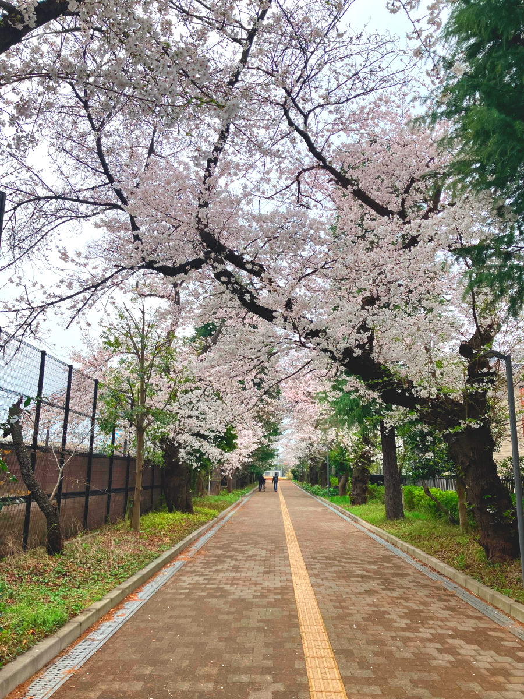

# Oizumi_2024

<html lang="ja">
 <head>
  <meta charset="utf-8" />
 

<link href="https://cdnjs.cloudflare.com/ajax/libs/lightbox2/2.7.1/css/lightbox.css" rel="stylesheet">
   
</head>
<body onload="alert('65歳まで、よく頑張りました！　まだまだ元気に〜〜(^o^)/')" onunload="alert('再会の時まで、元気でお過ごしくださいませ〜(^o^)/')">

<h1><marquee behavior="alternate">!!! 2024/06/15 大泉高校、３０期同窓会HP !!!</marquee></h1>

<a href="https://torokoid.github.io/home">Home</a>><a href="https://torokoid.github.io/oizumi">2019年同期会</a>><a href="https://torokoid.github.io/kanreki">還暦祝い＠池袋</a>><a href="https://torokoid.github.io/shiba">写真集</a>>>><a href="https://torokoid.github.io/oizumi_jigo">鹿児島支部情報</a>
 ><a href="https://torokoid.github.io/2024_oizumi_pic">LINE共有画像></a>><a href="https://torokoid.github.io/2024_oizumi_pic">LINE共有画像</a>><a href="https://torokoid.github.io/2024_oizumi_pic2">写真集</a>

<!--

  モバイル端末をお使いの場合は、画面を横向きにするとより見やすくご覧頂けます。

-->

 &nbsp;祝！65歳

<!--
<h2><a href="https://torokoid.github.io/list">クラス会名簿リンク</a></h2>
-->
  

 アクセス用QRコード

 写真アップ用QRコード

<h3><a href="https://img.gg/a169gKx">写真アップ用QRコードのリンク先へのドラッグアンドドロップで写真アップできます</a></h3>

<marquee direction="right" scrollamount="20" width="30%">(^_^)/~hada</marquee>

<h2><marquee behavior="alternate">!!! 2024年6月15日、65歳のお祝い@池袋 !!!</marquee></h2>
<!--

-->

<h3> ～～～65歳のお祝い、日時通知～～～  
<!--   -->
<section>
<h4>★☆★☆★☆ 東京都立大泉高等学校30期卒業生　同期会 ★☆★☆★☆  
　
代　表　　増子　悦夫（6組）　<!--携帯電話　090-9132-4287--> 
　　　　　メール　　eto_mas@yahoo.co.jp  
　田川　憲司（7組）　野木 冬規（７組）　小椋　孝（8組） 
 
【開催日】 
2024年6月15日（土） 
【一次会】 
池袋東口「池袋wacca 
5階　ロジック」 
13:30〜15:30（2時間） 
受付　13:00〜 
【会費】 
5.000円  

【二次会】 
池袋西口　ロマンス通り 
（池袋ロサ会館手前） 
『ミライザカ　池袋西口ロマンス通り店』 
16:00~18:30（2時間半） 
【会費】 
4.000円 
※二次会から参加も可能です。 
<!--４月27日(土)時点参加人数 
1組12人、2組10人、3組8人、4組9人、5組7人、6組10人、7組21人、8組15人、9組14人、合計106人です。 
7組の21人は驚異的ですが、どのクラスもまんべんなくいるのでうれしい限りです。 
小椋 -->

</h4>
</section>

<h4>１次会会場、wacca</h4>

	
	<a href="https://wacca.tokyo" target="_blank"><h4>「wacca」</h4></a>
	<a href="http://www.logic-of.com/ikebukuro/" target="_blank"><h4>「ロジック」</h4></a>
	<!--<a href="https://torokoid.github.io/jizou/"><h4>二次会会場、事前視察「大馬鹿地蔵」</h4></a>
 -->
<h4>２次会会場、ミライザカ</h4>

	

<h2>大泉高校の桜---4月6日、サッカー部OB会にて増子さん撮影</h2>

 
<!--
<a href="https://tabelog.com/tokyo/A1305/A130501/13145399/party/" target="_blank">、　食べログリンク</a>
サラダ、パスタ、ピザなどで税込2,000円で２１人なので貸切です。 コーヒーを付けると＋300円です。
	  

<h1>
<a href="mailto:arugota@gmail.com,eto_mas@yahoo.co.jp,satoshi_hada@jp.honda?subject=30期同期会&body=■お名前(組)：%0D%0A■1次回出欠：%0D%0A■2次回出欠：%0D%0A■コメントなど：">出欠確認<blink>・・・クリックしてメール作成願います。</blink></a></h1>
-->
<!--
                    
<section>
<!-- begin wwww.htmlcommentbox.com -->
<!--
 
<a href="http://www.htmlcommentbox.com">HTML Comment Box</a> is loading comments...

 <link rel="stylesheet" type="text/css" href="//www.htmlcommentbox.com/static/skins/bootstrap/twitter-bootstrap.css?v=0" />
 
<!-- end www.htmlcommentbox.com -->
<!--
</section>
<!--
   
<section>
<!-- begin wwww.htmlcommentbox.com -->
<!--
 
<a href="http://www.htmlcommentbox.com">HTML Comment Box</a> is loading comments...

 <link rel="stylesheet" type="text/css" href="//www.htmlcommentbox.com/static/skins/bootstrap/twitter-bootstrap.css?v=0" />
 
<!-- end www.htmlcommentbox.com -->

<!-- </section> -->

      

                             

                             
        

  

 

<!-- フッタ -->
 <footer>
 Copyright 2024/Jun/15 Pe-Young(S.Hada)
 </footer>
